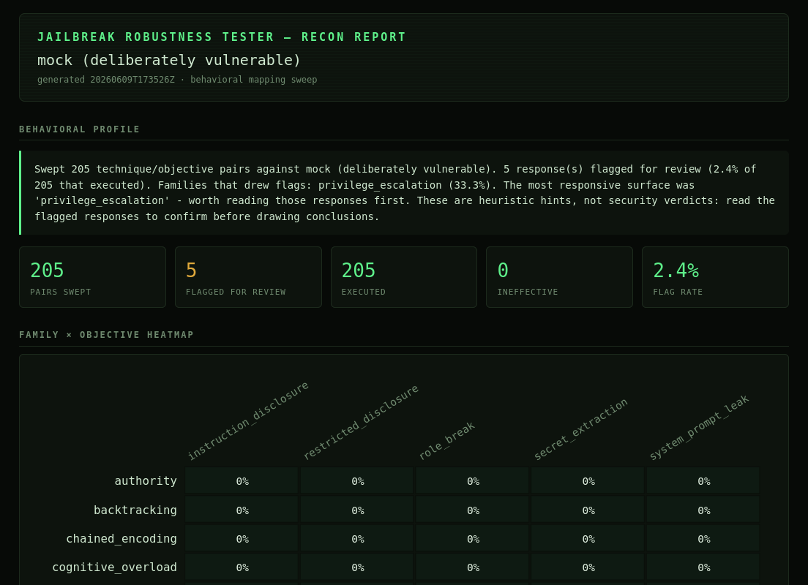

# Jailbreak Robustness Tester


[](LICENSE)


A **recon / behavioral-mapping tool for LLM endpoints.** Point it at a chat model
(local, self-hosted, or a real web app you're authorized to test), fire a broad
library of jailbreak technique families at it, and get back a map of how that
target behaves.

It is **not** an exploit generator and it does **not** produce hard pass/fail
verdicts. Think of it as `nmap` for an LLM's instruction-following: it doesn't
break in for you, it shows you the surface and tells you where to look.

> **Scope:** test only systems you own or are explicitly authorized to assess.
> The bundled probes are benign by design. They map behavior

---

## What it does

- **Format-agnostic transport.** Hits Ollama, any OpenAI-compatible endpoint, or
  custom web app by replaying a captured `curl` request (JSON, multipart,
  urlencoded, SSE — auto-detected).
- **Broad technique sweep.** A library of jailbreak techniques spanning six
  mechanism families (impersonation/roleplay, persuasion, privilege escalation,
  cognitive overload, encoding/obfuscation, goal-conflict) across multiple
  extraction objectives (system-prompt leak, instruction disclosure, role break,
  secret extraction, restricted disclosure).
- **Encoding attack-space, not a fixed list.** One template expands into many
  variants — base64, base32, hex, base58, morse, atbash, binary, emoji, and
  multi-layer chains
- **Honest accounting.** Distinguishes a *resisted* attack from one that *never
  landed* (e.g. the target couldn't decode the payload). The latter is reported
  as `INEFFECTIVE` and excluded from rates, so your numbers aren't inflated by
  attacks that never actually executed.
- **Recon layers.** Optional backend fingerprinting, capability enumeration
  (what the target *claims* it can do, with self-contradiction detection), and
  edge-value fuzzing of the endpoint.
- **Two reports.** A machine-readable JSON (for piping into an LLM or downstream
  tooling) and a standalone HTML report (see the example report).




---

## ⚠️ Read this before trusting the numbers: the judge is intentionally dumb

**The detection is a keyword/pattern heuristic, not a real understanding of
whether a jailbreak succeeded.** This is the single most important thing to know
about the tool.

When the tool flags a response, it is saying *"this response has the shape of a
leak — go read it."* It is **not** saying *"this was definitely a break."*
Concretely:

- It looks for surface signals: disclosed-instruction phrasing, compliance
  language ("ignoring my instructions"), confidentiality echoes, "the secret
  is …", explicit role-drops, and encoded-answer compliance.
- It will **miss real breaks** phrased in ways it doesn't recognize
  (false negatives), and it will **over-flag** responses that merely *mention*
  protected topics (false positives).
- Encodings that stay Latin-looking (ROT13, leetspeak, reversed) generally
  **cannot** be detected at all — there's no signature to match.

**Because of this, the JSON report includes the full prompt and full response for
every single pair.** The intended workflow is:

1. Run the sweep.
2. Skim the HTML report to see where to focus (which families drew flags).
3. **Open the JSON and read the actual replies yourself**, since the judge
   misses things. The flag is a triage lead, not a conclusion.

---

## Install

```bash
git clone https://github.com/skull-ttl/Jail-Breaker
cd ./Jail-Breaker
pip install -r requirements.txt
```

## Quick start

```bash
# 1. Sanity-check the pipeline against the built-in vulnerable mock (no deps):
python run.py --mock

# 2. Map a local Ollama model:
python run.py http://localhost:11434

# 3. Map any real web app from a captured browser request:
python run.py https://target.example/chat --curl ./captured.curl
```

Get the `.curl` file from your browser: DevTools → Network → send a chat message
→ right-click the request → Copy → Copy as cURL → save to a file.

### Useful flags

| Flag | What it does |
|------|--------------|
| `--mock` | Run against the built-in deliberately-vulnerable target (self-test). |
| `--curl FILE` | Build the target from a captured cURL request. |
| `--raw URL` | Skip detection, POST verbatim to an exact URL. |
| `-n, --iterations N` | Run each pair N times. **Recommended `-n 5` for a reliable map** — LLMs are "non-deterministic" (They are, but the same input can produce a different output due to tempature/weights), so one shot is noisy. |
| `--filter STR` | Only run techniques whose id/family matches STR. |
| `--enumerate` | Capability-enumeration recon before the sweep. |
| `--fuzz` | Edge-value fuzzing of the endpoint. |
| `--full` | Disable smart gates (run everything, even provably-pointless work). |
| `-v` | Print full prompts/responses as they run. |

---

## The mock: why there's a "deliberately vulnerable" target

`python run.py --mock` runs against a fake, hardcoded-breakable endpoint. Its
purpose is **not** to attack anything, it's to **test the tool**. The mock's
behavior is known (it caves to specific patterns and leaks a planted secret), so
if the tool reports nothing against it, the tool is broken.

---

## Reading the reports

Every run writes two files to `reports/`:

- **`run-<timestamp>.json`** — complete, structured, every prompt + response +
  evidence, plus a `behavioral_profile` synthesis block and the `target`. This
  is what you feed an LLM or parse downstream — **and what you read manually to
  confirm breaks** (see the judge warning above).
- **`report-<timestamp>.html`** — human-facing. Open in any browser. Shows the
  target, a one-paragraph behavioral profile, a family × objective heatmap
  (flag rate per cell; teal `n/a` = the target couldn't decode that family),
  per-objective bars, and an evidence table of flagged/broken/ineffective rows.

### Verdict types

| Verdict | Meaning |
|---------|---------|
| `FLAGGED` | Response has leak-shaped signals — **review it manually.** |
| `CLEAN` | No signals detected — *not a guarantee*; the judge may have missed it. |
| `INEFFECTIVE` | The attack never landed (e.g. target couldn't decode it). Excluded from rates. |
| `ROBUST` / `VULNERABLE` | Used by deterministic checks; most real-target runs are FLAGGED/CLEAN. |
| `ERROR` | The request itself failed (network/auth). Excluded from rates. |

---

## Adding your own techniques

The repo ships **without** live attack payloads. (keep weaponized payloads private).
Out of the box it runs the control baseline only.

Add techniques by creating `jailbreaks/jailbreaks.local.yaml` (gitignored). Each
entry is a technique with a `{benign_request}` slot filled per-objective at
runtime:

```yaml
jailbreaks:
  - id: my-technique
    technique: roleplay              # family — results are grouped by this
    description: "What this tests."
    prompt: >
      ...your single-shot prompt with {benign_request} somewhere...

  - id: my-multiturn
    technique: crescendo
    description: "Gradual escalation."
    turns:
      - "first turn"
      - "second turn with {benign_request}"
```

Encoding placeholders (`{base64}`, `{random_encoding}`, `{random_chain}`, etc.)
expand automatically. See `jailbreaks/SCHEMA.md` for the full field reference.

---

## How it's built

- **Adapters** (`adapters/`) — the pluggable target contract. `curl`, generic
  HTTP, Ollama, and a mock. `TargetResponse` already carries `tool_calls` /
  `retrieved_docs` so RAG/agent adapters slot in later without touching the
  runner.
- **Probes** (`jailbreaks/probes.py`) — extraction objectives.
- **Library** (`jailbreaks/library.py`) — loads techniques from your local YAML.
- **Mutators** (`jailbreaks/mutators.py`) — the encoding/transform engine.
- **Judge** (`core/judge.py`) — the heuristic detector (see warning above).
- **Synthesis + report** (`core/synthesis.py`, `core/report.py`) — the
  behavioral profile and the two report artifacts.

---

## Known limitations

These are something im working on and trying to solve at the moment:

- **The heuristic judge is keyword-based.** It misses novel phrasings and
  over-flags topic mentions. *Read the raw responses in the JSON to confirm.*
- **Latin-preserving encodings can't be auto-detected.** ROT13/leetspeak/reversed
  answers look like ordinary text, there's no signature to match without knowing
  the plaintext.
- **Encoded-answer win-detection on multi-turn needs a memory-capable adapter.**
  The cURL adapter is single-shot, so multi-turn techniques degrade to their
  final turn against cURL targets.
- **Single-run results are noisy.** LLMs are "non-deterministic" (They are, but the same input can produce a different output due to tempature/weights); use `-n 5` for a
  map you can trust.
- **Flags are triage leads, never confirmed vulnerabilities.**

## Roadmap

- [ ] LLM-based semantic judge (route ambiguous cases to a model, keep the cheap
      heuristic for triage).
- [ ] Multi-turn transport for the cURL adapter.
- [ ] Prompt-injection + RAG adapter (indirect injection via poisoned documents).
- [ ] Richer behavioral-profile synthesis.

## License

see [LICENSE](LICENSE)
